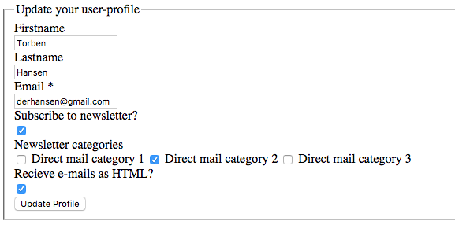
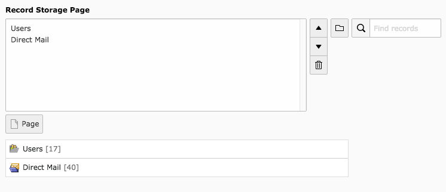

Femanager direct mail subscription
==================================

## What is it?

Femanager direct mail subscription is an extension for TYPO3 CMS to add direct mail subscription fields to
femanager extension.

The following fields will be available in femanager plugin:

* Newsletter subscription
* Newsletter category
* HTML newsletter

New and existing users will be able to subscribe to a direct mail newsletter and select direct mail categories if
enabled.



## Installation

1. Install the extension
2. Include the static TypoScript "femanager direct mail subscription"
3. If you want to use direct mail categories, add the folder(s) with direct mail categories to the storage page 
settings in femanager plugin



4. Select the direct mail fields in femanager plugin settings

## How to change language labels

If you want to add translated language labels, simply add the following TypoScript setup to 
your TypoScript template (example in german below)

```
plugin.tx_femanagerdmailsubscribe {
  _LOCAL_LANG.de {
    label.moduleSysDmailCategory = Newsletter Kategorie
    label.moduleSysDmailHtml = HTML E-Mails empfangen?
    label.moduleSysDmailNewsletter = Für Newsletter anmelden
  }
}
```

## Feedback and updates
 
This extension is hosted in GitHub. Please report feedback, bugs and change requests directly at 
https://github.com/derhansen/femanager_dmail_subscribe